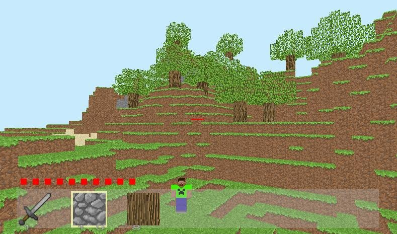
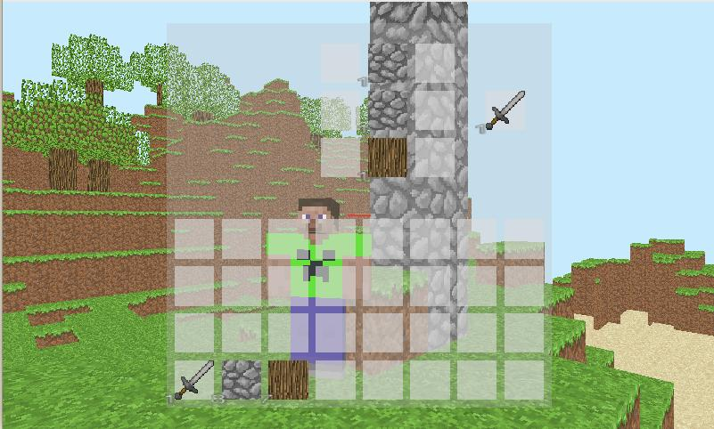
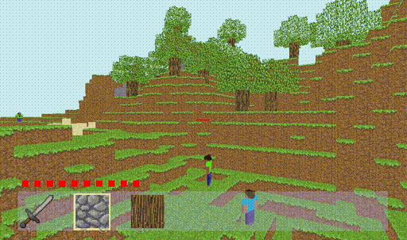
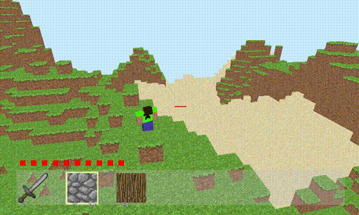

# Crafty

This is a fork of a [team project](https://github.com/arthurbricq/crafty) that I did with my brother and some friends.

A MineCraft clone coded from craft, fully in Rust (without any game engine or any multiplayer framework)



That works in multiplayer, and with monsters.


And that allows you to craft and to mine ! 



## In action

Here are some `GIF` to show a little the gameplay... (**In multiplayer !**)

*A player moving through different biomes*


*A player running away from a monster*



*A player placing blocks while jumping*




## Current list of features

- **Graphics rendering**
    - We use bindings to **OpenGL** (*glium.rs*) to render all the **cubes**. We are able to render tens-of-thousands of cubes using much different optimization.
    - Easy way to import new textures into the game, allowing to easily reproduce minecraft-like landscape.
    - Easy way to presents `Tiles` on the screen (menus) and a custom way to render text. We have implemented **debug menu** (`F3`), a **help menu** (`F12`).
- A custom **Game Engine**, featuring
    - **Detection of collision**. This was not a piece of cake. We used **AABB** collision algorithm to solve this problem.
    - **Gravity**, Free-Fall, Jumping
    - **Ray tracing** to detect actions with the world and with other players.
- **Minecraft Gameplay**
    - Edition of the world like in minecraft: you can add cubes, collect cubes.
    - A **crafting framework** (press 'E' and you will see for yourself !). Craft a sword to attack your friends.
    - **Items** displayed on the screen, exactly like in Minecraft.
    - An **attack system** with life points for each players.
    - Automatic **monsters** which walk over the world and will try to kill you ! Click `x` when playing to spawn monsters, they will fall from the air above you.
- A smart **world creation** system
    - Persistent world: loading and saving the world to the disk by pressing `F10` (singleplayer)
    - Randomized map creation, using **Perlin noise** to have some randomness and with different **biomes** to look super beautiful !
    - Different **biomes**
- A **Multiplayer Game** ! 
    - A **multithreaded TCP server** is in charge of (1) the game logic (map, monsters, etc...) (2) synchronizing all players by receiving `MessageToServer` and dispatching `ServerUpdates`
    - An reusable architecture using `Trait` that abstracts to the client (`WorldRenderer`) whether he is in single player or in multiplayer.

## Getting started

This project surely still has some bugs and everything, we did mostly over 1 weekend. 

But the `main` branch is supposed to run !

### Single Player

To run in **single player**, use:

```console
cargo run --bin crafty --release -- INIT_MODE
```

(*You need to run in release*)

For `INIT_MODE`, you can use
- `--random`: generates a random world using our world creation
- `--flat`  : generates a flat world
- `--disk`  : tries to load the `map.json` on the disk
- If put nothing, will use `--random`

Press `x` to spawn some monsters above you !

### Multi Player

To run in **multiplayer**, first launch a server like this:

```console
cargo run --bin server --release -- --server "YOUR.IP"  --port "PORT" --init random
```

- You need to write your IP address when running the server...
- You don't need to specify which world initializer to use, by default it will be the random one

Then, every client can connect like this: 

```console
cargo run --bin client --release -- --server "YOUR.IP" --port "PORT" -- name "UNIQUE_IDENTIFIER"
```

- Each client needs to specify his name, and it needs to be different than the other players.

## Crafting recipes (for now)

Stone word:
```
_c_
_c_
_o_
```
where `c` is a cobblestone block, and `o` is an oak log. 

## Next steps

This project works quite well, but... There is still a lot to do.

### Missing features

- Infinite map creation (*almost there*)

### Problems

- The collision often crashes.
- The multiplayer architecture should be improved.
- There is a bunch of corner cases with multiplayer.
- The performances are quite bad.
